# Cinema App (Java)

**Cinema App** is a Java-based desktop application designed to manage movie theater operations efficiently. This project provides a user-friendly interface for browsing available movies, viewing showtimes, and managing ticket reservations.

### Key Features:

* Display a catalog of movies with detailed information (title, genre, duration, description)
* Show real-time screening schedules and available seats
* Allow users to book and cancel tickets
* Manage user accounts and booking history
* Simple and intuitive GUI built with Java Swing (or relevant UI framework)
* Data persistence through file storage or database integration

### Technologies Used:

* Java SE
* Swing/AWT for GUI
* File handling or JDBC for data storage (depending on implementation)

---

# Interface description
## Automated system of cinema operation
An application for automation of cinema operations that allows users to log in and register, and provides the administrator with the ability to manage films, sessions, actors and halls, while viewers or cashiers can select films, filter sessions and book tickets.

### Authorization
When authorizing a user, a window will be displayed in which the user's login and password must be entered. When pressing the "Login" button, depending on the user's role, either the administrator menu or the viewer menu will be opened

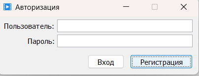
### Registration
If the user decides to register, a window will be displayed in which the user's login and password must be entered. After that, the viewer menu will be displayed.

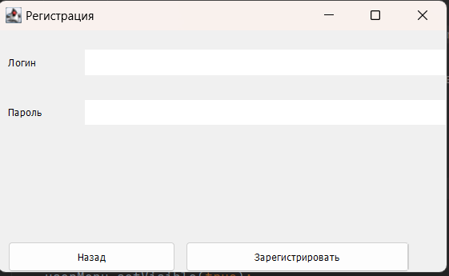
### Admin Menu
If authorization is successful and the user has the administrator role, the administrator menu will open.

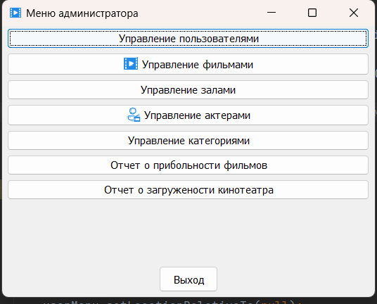
### Window for working with movies
The administrator can start working with movies.And the viewer can select a film from the provided list and search and filter. The column “Nearest show” displays the dates of either the last completed show or the nearest one in the future.

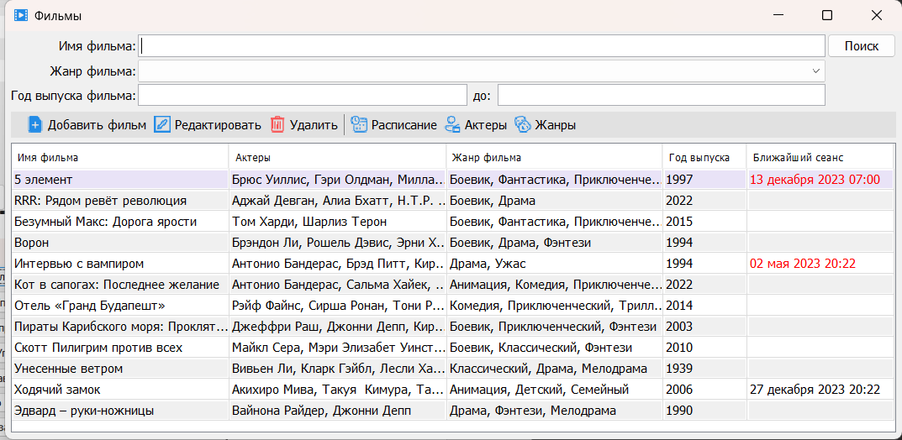
### Window for working with movie sessions
To work with sessions of a specific film, a window will be opened for selecting film sequences.The viewer can also select a movie session from the provided list and search and filter the desired one by time and date.

### Window for working with movie sessions
To work with sessions of a specific movie, a window for selecting movie sessions will be opened.And the viewer can select a film from the provided list and search and filter. The “Next Show” column displays the dates of either the last completed show or the next one in the future.

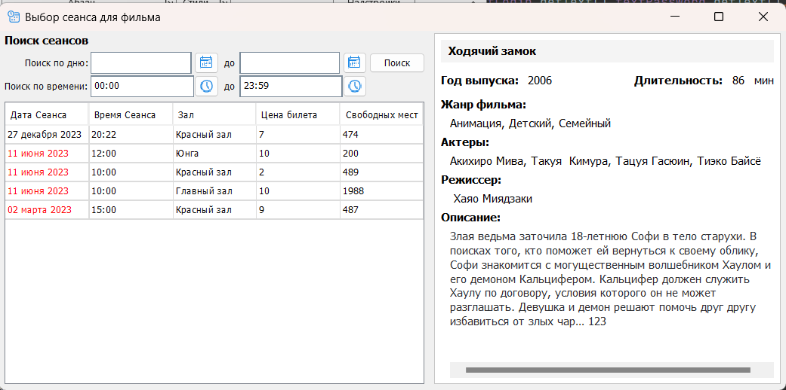
### Dialog for adding a session to a movie
To add a movie session, the “Movie Session” dialog will be displayed.

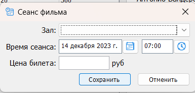
### Dialogue for adding actors to a movie
To add actors to your movie, the Movie Actors dialog will be displayed.

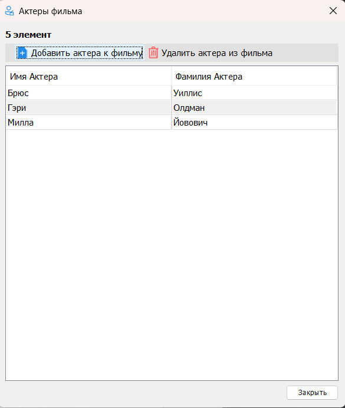
### Window for working with actors
If the administrator wants to add or remove an actor to work with actors, the “Actors” window will be displayed. You can also do the opposite by adding a new actor to the film by going to the previous dialog.

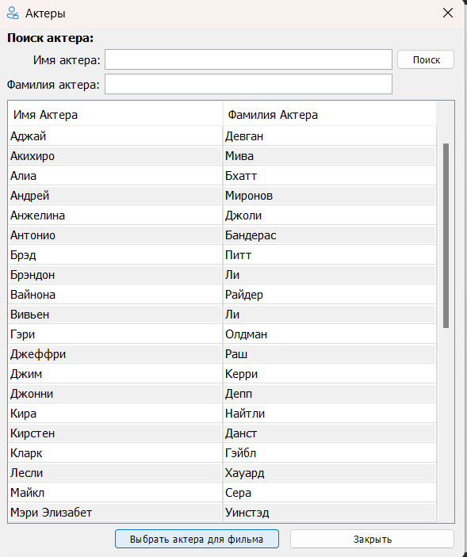
### Dialog for adding categories to a movie
To add categories for a movie, the “Movie Genres” dialog will be displayed. To add categories, use the check boxes, after which you need to save the changes.

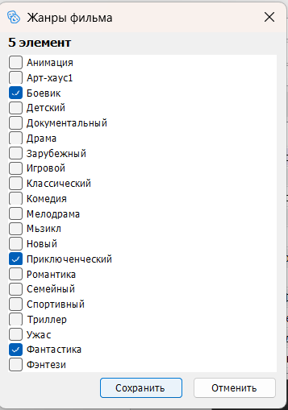
### Movie editing dialog
To edit movie information, a window will be displayed where you can edit basic movie information.

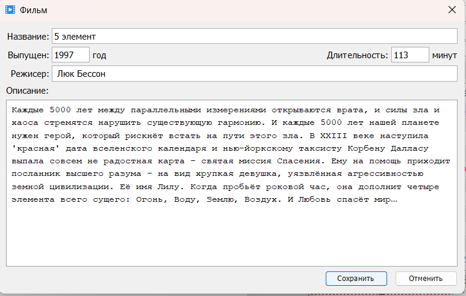
### Window for working with halls
In order to edit the cinema hall database, the “Hall Management” window will be displayed.

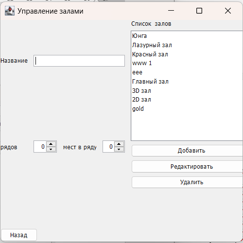
### Window for working with users
In order to edit the user base, the “Users Management” window will be displayed.

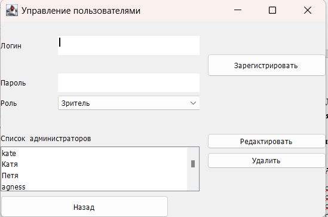
### Window for working with categories
In order to edit the category database, the “Category Management” window will be displayed.

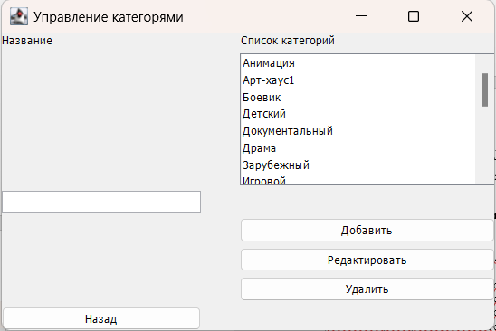
### Viewer's menu
If authorization or registration was successful and the user has the role of viewer, the viewer menu will open.

### Booking tickets for the show
To reserve a seat, as well as to cancel previously booked seats, the “Book tickets for the show” window will be displayed.

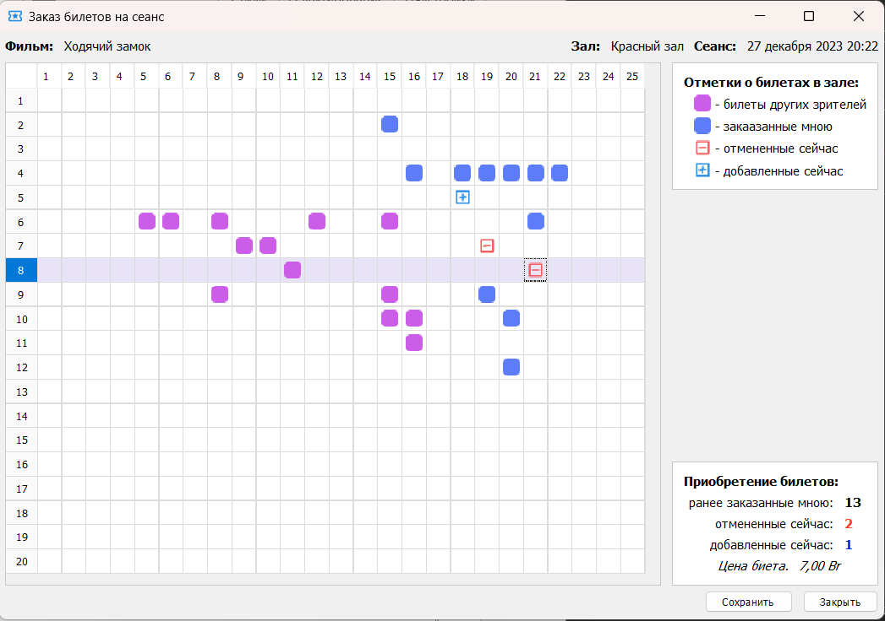
